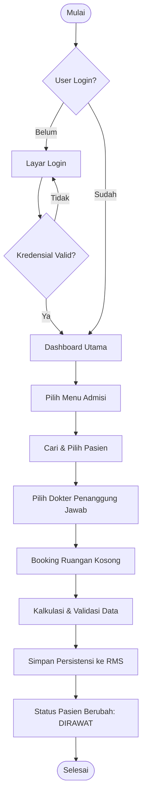

# 🏥 Hospital Inpatient System (Sistem Rawat Inap J2ME)
*(Dokumentasi Resmi Proyek)*

Dokumentasi ini menjelaskan arsitektur, implementasi teknis, serta kebutuhan sistem dari proyek aplikasi Sistem Manajemen Rawat Inap berbasis Java 2 Micro Edition (J2ME).

---

## 1. Requirements (Persyaratan Sistem)
Untuk menjalankan, melakukan kompilasi, dan mengembangkan aplikasi ini, diperlukan spesifikasi lingkungan sebagai berikut:
- **Platform Target:** J2ME (Java 2 Micro Edition) - MIDP 2.0 / CLDC 1.1
- **JDK:** Java SE Development Kit 8 (JDK 1.8) - *Diperlukan untuk kompatibilitas bytecode dengan `ant` build.*
- **Build Tool:** Apache Ant (Versi 1.10.x atau terbaru)
- **Emulator:** Sun Java Wireless Toolkit (WTK) 2.5.2 for CLDC
- **Penyimpanan:** Dukungan sistem untuk Record Management System (RMS) Java.

---

## 2. Fungsi Aplikasi (APK)
Aplikasi ini ditujukan untuk mengatur operasional dan tata laksana rawat inap pasien pada tingkat rumah sakit atau klinik. Fitur intinya meliputi:
- **Sistem Autentikasi:** Login aman dengan sistem enkripsi *hashing* iteratif (tersedia manajemen role User/Admin).
- **Manajemen Pasien:** Pendaftaran pasien baru, modifikasi data, pencarian pasien, serta pembaruan status (Aktif, Dirawat, Pulang).
- **Manajemen Kamar/Ruangan:** Ketersediaan ruang rawat yang divisualisasikan secara langsung.
- **Proses Admisi:** Tata cara penerimaan pasien dari unit luar (UGD/Poliklinik) untuk di-booking ke bangsal rawat inap, menghubungkan antara Pasien, Dokter, dan Ruangan.
- **Apotek & Obat:** Penanganan resep dan stok obat.
- **Sistem Penagihan (Billing):** Akumulasi biaya otomatis (Biaya ruangan + Tindakan + Obat).

---

## 3. Mockup Design & UI/UX
Telah terjadi transisi dari UI standar (J2ME Form bawaan) menuju **Custom Canvas-based Layout** yang memberikan keleluasaan merender komponen modern pada layar ponsel lawas.
* **Tema Visual:** Modern, cerah (Bright Theme), mengedepankan warna putih yang bersih dengan aksen biru medis, memberikan kesan menenangkan (*calming*).
* **Komponen Grafis Kustom:**
    * *Radio Button & Checkbox* dengan animasi *state* perubahan.
    * *Data Table* interaktif untuk merender daftar pasien dengan sistem *pagination/scrolling*.
    * *Date Picker / Calendar Input* berbasis grid untuk pengisian tanggal secara terstruktur.
    * *Visual Status Indicator*, menggunakan pendekatan desain *"Cinema-Seat Booking"* untuk merepresentasikan ketersediaan ruang ranjang (Warna Merah untuk Penuh, Hijau untuk Tersedia).

---

## 4. Implementasi Kode OOP
Proyek ini mengadopsi prinsip dasar **Object-Oriented Programming (OOP)** dengan ketat dan bersih:

### A. Inheritance (Pewarisan)
* **Model Layer:** Entitas inti saling diwariskan untuk mengurangi duplikasi. Kelas `Pasien`, `Dokter`, dan `Perawat` mewarisi kelas abstrak `Person`. Selanjutnya, kelas `Person` mewarisi properti fundamental (seperti `id`) dari superclass `Entity`.
  ```java
  public abstract class Person extends Entity { ... }
  public class Pasien extends Person { ... }
  ```
* **Storage Layer:** Pattern abstrak diterapkan pada sistem database RMS. `PasienDB`, `UserDB`, `RuanganDB` mewarisi fungsi CRUD massal dari abstrak `BaseDB` menggunakan *Template Method Pattern*.

### B. Encapsulation (Enkapsulasi)
* Semua atribut atau *field* di dalam kelas dienkapsulasi rapat menggunakan modifier `private` atau `protected`.
* Mutasi dan akses data dilindungi melalui metode *Getter* dan *Setter*. Hal ini memastikan keamanan transisi *state* program, contohnya mencegah update status pasien menggunakan teks yang tidak valid.
  ```java
  private String status;
  public String getStatus() { return status; }
  public void setStatus(String status) { this.status = status; }
  ```

### C. Polymorphism (Polimorfisme)
* **Method Overriding:** Konsep polimorfisme diimplementasikan untuk memberikan representasi tekstual yang spesifik tiap kelas. Method `tampilkan()` yang berasal dari kelas `Person` ditimpa (*override*) oleh kelas `Pasien` untuk menambahkan detail mengenai status perawatannya secara runtime.
  ```java
  // Di class Person
  public String tampilkan() { return nama + " (" + id + ")"; }
  
  // Di class Pasien (Overridden/Polimorfisme dinamis)
  public String tampilkan() { return nama + " [" + status + "]"; }
  ```
* **Interface Implementation:** Sistem *Storage* diakses melalui instansiasi polimorfik interface (misal `IPasienRepository`), sehingga komponen Service layer tidak mengetahui implementasi nyata dari RMS.

---

## 5. Flowchart
Berikut adalah diagram alir (*Flowchart*) dari proses utama yaitu **Sistem Admisi Pasien**:



---

## 6. Architecture System
Aplikasi ini dibangun menggunakan arsitektur **Multi-Tiered Layered Architecture** dipadukan dengan implementasi *Dependency Injection (DI)* Singleton pada perangkat J2ME.

```mermaid
graph TD
    subgraph Presentation Layer (UI)
        UI[Custom Canvas Screens] --> SM[Screen Manager / Stack]
    end

    subgraph Service Manager (DI)
        SF[Service Factory Singleton]
    end

    subgraph Business Logic Layer (Services)
        AS[Admisi Service]
        PS[Pasien Service]
    end

    subgraph Data Access Layer (Repositories)
        BaseDB[BaseDB Abstract]
        PDB[Pasien DB]
        UDB[User DB]
        BaseDB -.->|Inheritance| PDB
        BaseDB -.->|Inheritance| UDB
    end

    subgraph Persistence Store
        RMS[(J2ME RMS)]
    end

    UI -->|Get Instance| SF
    SF --> AS
    SF --> PS
    AS --> PDB
    PS --> PDB
    PDB -->|Byte Serialization| RMS
    UDB -->|Byte Serialization| RMS
```

1. **Presentation Layer:** Hanya menangani perhitungan *render* komponen visual UI dan input *Keypad/Pointer*, serta mengirim panggilan (*Action*) ke Service terkait. Termasuk `ScreenManager` yang menangani `Vector`-based routing history.
2. **Service Factory:** Bertanggung jawab sebagai pusat injeksi *Dependency* agar setiap *Repository* hanya diciptakan sekali dalam siklus hidup program.
3. **Business Logic Layer:** Mengimplementasikan proses transaksional validasi *logic* operasional Rumah Sakit.
4. **Data Access Layer / Persistence:** Menyediakan sistem penyimpanan *In-Memory Cache* beserta serialisasi data objek (Obj -> Byte Array) untuk disimpan ke memori penyimpanan non-volatile J2ME (Record Management System).
